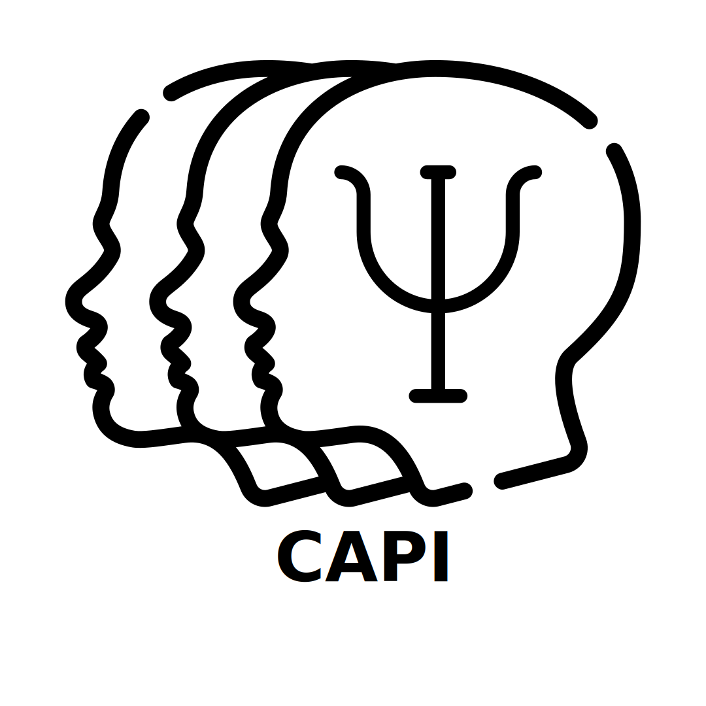

# capi
Cognitive Automatic Psychology Interface

This is the code repository for our final project in Information Systems Engineering.
> Yuval Khoramian - 207611492 , Shoham Zarfati - 318501418 , Hod Twito - 315230482 , Ron Zeidman - 315154864

# Project Structure

* `doc` - inside the doc directory we have presentations and documentation for the practical portion of our project
* `client` - inside the client directory is the client module as described in the [project overview](https://github.com/capi-bgu/capi/blob/master/doc/project_overview.md)
