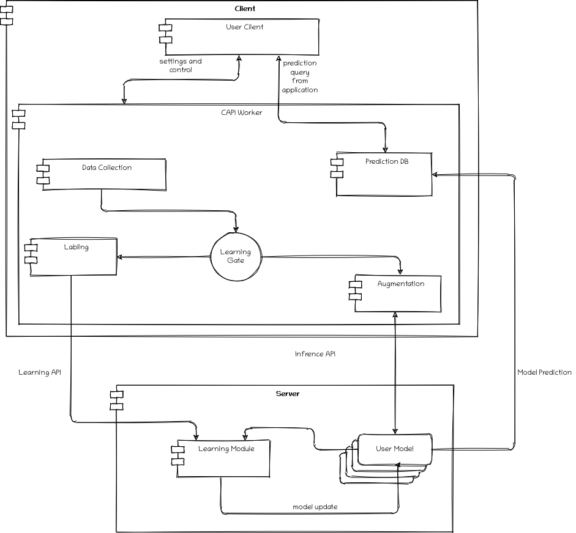

# CAPI Overview

In this project, we attempt to advance the field of affective computing by creating a platform that will allow for future research and
development into creating personalized emotion recognition models that will be able to analyze a user's emotional state, both online and
offline. Such development could allow computer systems to better interact with users in a variety of ways. From Filtering out bad news if the user
is feeling down to helping psychologists track their patients' mental health.

## Project Goals

* The project's first goal is to create a software platform that will ease the creation of personalized machine learning models.
  The platform will be as implementation-independent as possible to allow the easy integration of research in this field.
  The platform will try to provide utilities that will be 
  necessary for any method trying to create personalized models, such as data gathering and labeling.

* The second goal is to develop a model or a collection of models that will be integrated with the platform and hopefully compete with the state of the
  art in emotion recognition.

## Architecture

This section will give an architecture overview of how the software platform should look and operate. 

In the above diagram, we can see a general architecture. The platform is composed of two major modules:

* Client - The client runs on the user's computer and is in charge of gathering data, whether it is for learning or prediction.
* Server - The server can be in a remote location and is in charge of the more demanding computations, such as training the personal models and running
  the models on the user's data.

### Client

The client is also composed of two components. The first is the user client, which is the actual application the user can interact with. This can come in 
different forms,
most likely a GUI that will summarize the workers' operations and control its settings, in addition to using the predictions coming from the server in some way. The second component is the worker. This will most likely be a separate process running on the user's computer, though it could also run on a 
different machine depending on the circumstances. The worker is the mediator between the server, the user client, and the user himself (his data).

* Data Collection - The data collection module is straightforward. It collects the user's data that is needed for the model to make its predictions, this module 
  needs to be very extensible as different methods might require different data sources and variants.

* Learning Gate - The learning gate is a simple construct that can be tuned for each model or user. It simply decides when the model needs to continue its training.
  If it determines the model can make a prediction, the data from the Data Collector is passed to the Augmentation module. Otherwise, the data will be 
  passed to the learning module.

* Learning Module - When the learning module receives data, it will try to label it (usually by prompting the user). Once the data is labeled, it can be sent to the server to train the model.
  Again the module will be extensible, allowing different labeling options to be implemented.

* Augmentation Module - When data reaches the augmentation module, it means that it needs to get to the server to make a prediction, 
  the augmentation module has two goals:
  - Preprocessing - usually, a model needs the data to be preprocessed in some way before it can be used. As this is a relatively cheap operation, it is 
    performed in
    the client to save compute time on the server.
  - Reduction - Some models can split in a way that allows one part to reduce the dimensionality of the data and the other to make a prediction using the data embedded in the 
    reduced dimension. An excellent example of that is a CNN architecture with multiple pooling layers. Because the data is often not small, 
    especially with images or videos, we prefer to run as much of the model as possible on the client. If we continue with the CNN example, the image will run 
    through the model's first few layers. This will reduce the data's size. The data will be sent over the wire to the server, where the rest of the computation will complete.
    This might not always be possible, but when it is, it has the potential to save a lot of the time spent transferring the data over the wire.

* Prediction Database - The prediction database contains the results of the prediction from the server. This is necessary because we might not want to use the 
  results immediately, instead wait for when some event occurs (for example, when a news report comes in, the user client will query the database and check the 
  user's current mood).

### Server

The server is meant to perform the more expensive computations, and as such, will likely not be running on the client machine, though in some situations, the 
server may also run on
the same machine as the client, a perfect example is if we do not want any of the client's data moving through the internet.
The server exposes two APIs:

* Learning API - the learning API receives requests from the client with labeled data. The data from the client is collected and then applied to the client's
  model during training runs.

* Inference API - the inference API receives requests from the client with unlabeled data. After it passed through the augmentation module, the server runs the 
  clients model on the data
  and returns the predictions to the client.

This paradigm, where each client has a personalized model on the server, can quickly get very expensive. A few possible improvements can be running part of 
the model in the augmentation module
on the client as discussed before, Having parts of the model shared between clients (if we use the CNN example again, many of the features will be shared by all 
clients and each client will have some additional features and maybe also individual FC layers). If an ensemble method is used, some of the models may be 
shared between multiple or all clients.

## Research

in our research, we will try to use two different methods for predicting the user's emotional state:

* Face Recognition - This is the most researched approach, using face recognition models to recognize facial expressions.
  Current methods lack an understanding of emotion and instead focus on identifying facial features commonly associated with emotion.
  However, emotion is rarely as simple as a facial expression and needs context, both of the person and his surroundings.
  By creating personalized models, we try to learn how each user expresses emotion.

* Primitive inputs - Using inputs like keystrokes and mouse movements, we hope to find patterns that hint at the user's emotion, with minimal invasion of the user's privacy.
  This can also be used in combination with the facial recognition model to provide context to the user's facial expressions.

Another consideration is labeling. Most models trying to predict user emotion use a small array of emotions like anger, happiness, surprise, etc. These emotions are products of
underlying phenomena called affect, which is more continuous and less rigid than the traditional notion of emotions. We will also attempt to create regression models that will
predict in continuous dimensions such as Valence (negative-positive) or Arousal (calm-active).